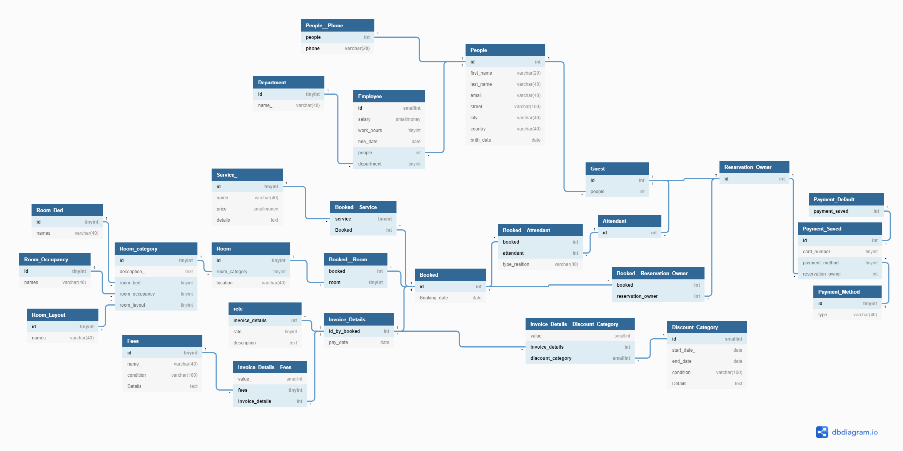

# DB2_EERD

### **Business Rules**

- [PDF](Business_Rules_V2.pdf)
- [word](Business_Rules_V2.docx)

### **EERD**

### **Schema**  

### **Tools** 
 
- [ERD - draw.io](https://draw.io)
- [schema - dbdiagram.io](https://dbdiagram.io/home)
- using... soon..
  - [Documentation - dbdocs](https://dbdocs.io/?utm_source=dbdiagram)
  - [Database Markup Language - dbml](https://www.dbml.org/home/#intro)

### **More**

- [Rooms](/rooms.md)
